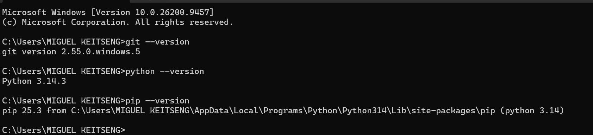
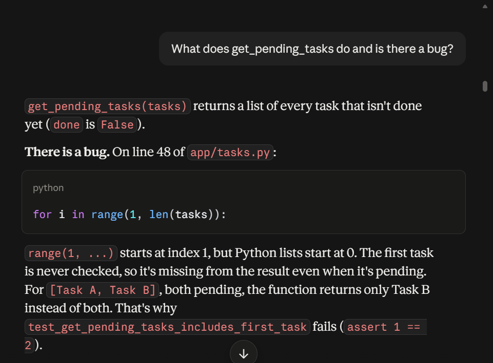
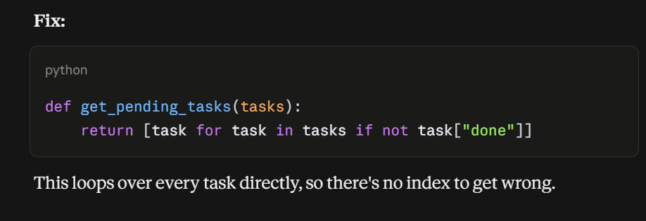

# COMP 441 — Lab 1: Manual Defect Log

Repository: task-manager (Python). 
Files reviewed: `app/tasks.py`, `app/storage.py`, `app/cli.py`, `tests/test_tasks.py`.

## 1. Defect Log

"Verified" = I ran the code and reproduced it. "Read" = found by reading only.

ID	File	Line	Description	Severity	How found
D01	app/storage.py	4	Hard-coded API key committed in source (the TODO admits it should be an env var). Credential leak.	Critical	Read
D02	app/storage.py	26	SQL built by string concatenation with title_filter, so it is open to SQL injection (e.g. ' OR '1'='1). Needs parameterised queries.	Critical	Read
D03	app/storage.py	11	"Task #" + task["id"] concatenates str + int, raising TypeError. The CLI crashes as soon as one task exists.	High	Verified
D04	app/tasks.py	48	range(1, len(tasks)) starts at 1, so the first task is never returned by get_pending_tasks.	High	Verified (test fails: 1 != 2)
D05	app/tasks.py	59	average_priority([]) divides by zero (ZeroDivisionError). No empty-list guard.	High	Verified (test fails)
D06	app/tasks.py	26	id = len(tasks) + 1 produces duplicate IDs after a removal (tasks 1,2 → remove 1 → new task also gets id 2). complete_task and remove_task then hit the wrong task.	High	Verified (ids: [2, 2])
D07	app/tasks.py	23	Mutable default argument tags=[] is shared across calls, so tags added to one task appear on all others.	High	Verified
D08	app/tasks.py	11–13	File opened without with and never closed (resource leak).	Medium	Read
D09	app/tasks.py	12	json.load has no error handling. A corrupt or empty tasks.json crashes the app on startup.	Medium	Read
D10	app/tasks.py	5	TASKS_FILE is a relative path, so data is loaded from or saved to whichever directory the app is run in.	Medium	Read
D11	app/storage.py	18–21	days_until_due subtracts now() (with time of day) from midnight, so a task due today returns -1 (off by one).	Medium	Verified (-1)
D12	app/cli.py	2, 6–11	CLI only loads and prints. save_tasks and add_task are imported but unused and there is no way to add or complete tasks, so the app's main features can't be exercised.	Medium	Read
D13	app/tasks.py	77–82	calculate_discount has no validation (negative price, non-bool is_premium), a magic number (0.8), and float rounding. == True is non-idiomatic.	Low	Read
D14	app/tasks.py	62–66	find_task_by_title implicitly returns None, is case-sensitive, and callers aren't warned.	Low	Read
D15	app/tasks.py	69–74	remove_task silently does nothing when the id doesn't exist and gives no success/failure result (unlike complete_task).	Low	Read
D16	tests/test_tasks.py	—	No tests for remove_task, find_task_by_title, load/save_tasks, days_until_due, format_task_report or build_query. This is why D03, D06 and D11 go unnoticed.	Low	Read

## 2. Existing test suite results

Command: `pytest`

- Total tests: **6**
- Passed: **4**
- Failed: **2**
  - `test_get_pending_tasks_includes_first_task` (D04, off-by-one)
  - `test_average_priority_of_empty_list` (D05, ZeroDivisionError)

## 3. Tool versions

Captured on my machine (screenshot attached in submission folder as `tool-versions.png`):

- Git: 2.55.0.windows.5
- Python: 3.14.3
- pip: 25.3

AI assistant confirmation: 
## 4. Reflection 

Reflection

Several of the defects I logged would be caught quickly by a linter or an automated test. D04 (the off-by-one in get_pending_tasks) and D05 (division by zero in average_priority) are already caught by the existing test suite, which fails on both. A linter such as pylint would flag D07 (mutable default argument tags=[]) as a dangerous default value, D08 (file opened without "with") as a resource-handling issue, and D13 (comparison "== True") as a style issue. The hard-coded API key (D01) and the SQL injection (D02) would be caught by a secret scanner or a security tool such as Semgrep or Bandit, although a basic linter would miss them. D03 (concatenating a string with an integer) would crash as soon as any test or run reached format_task_report with data, but no such test exists, so it currently goes unnoticed.

